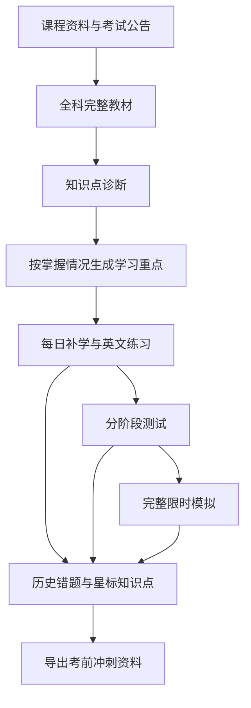

# Bilingual Exam Review Site · 双语期中复习网站

**把课程资料整理成完整教材，用知识诊断找到薄弱点，再把复习落实到每天。**

这是一个可复用的 Codex skill，用于根据课程 PDF、考试公告和已有学习记录，制作可直接打开的 HTML 复习网站。它将中文知识讲解、英文练习、知识点诊断、每日计划、完整模拟卷和考前冲刺资料整合到同一条学习路线中。

本项目来自一个真实的四科期中复习任务：MATH2023 多元微积分、MATH2121 线性代数、CHEM1008 普通化学和 COMP2711 离散数学。功能经过实际需求迭代，兼顾零基础学习、英文考试阅读、多科时间安排和学习进度迁移。

> **仓库内容：**这里提供的是构建与更新网站的 skill、需求归档和方法说明。生成后的个人网站及课程资料由具体任务另行交付；本仓库不包含那份私人网站的应用源码、课程 PDF 或个人学习记录。

## 项目亮点

- **完整教材先行**：每科提供连续阅读的知识点教材，从符号、概念和直观解释讲到方法、例题与易错点。
- **中文学懂，英文练熟**：讲解以中文为主、英文术语辅助；练习题干和选项以英文为主，中文帮助按需展开。
- **按知识点诊断**：分别识别每个单元的掌握情况，保留“不确定”和“不会”的真实反馈。
- **按薄弱点安排学习**：跳过已掌握部分，保留混合任务中的薄弱部分，并在已有时间预算内安排补学。
- **每天都有具体下一步**：任务直接连接教材、练习或模拟卷，支持完成后继续下一学习日的内容。
- **考前资料随学习积累**：历史错题和星标知识点可以合并导出，形成个人冲刺资料。
- **保留离线访问**：完整 HTML 与相邻资料目录可以打包携带；需要在线访问时，也可按用户要求发布网站。

## 适合谁

- 需要从基础概念补起，希望看到详细解释和完整演算过程的大学生。
- 同时准备多门考试，希望兼顾复习顺序、作业截止和休息时间的学生。
- 理解中文更顺畅，但需要适应英文术语、题干和考试卷的学习者。
- 希望导入既有进度，让复习计划随掌握程度调整的人。
- 希望使用自己的讲义和试卷，构建个人课程复习门户的人。

## 网站功能一览

| 模块 | 主要功能 | 使用价值 |
| --- | --- | --- |
| 总览与倒计时 | 各科考试日期、时间、规则、今日任务和完成情况 | 快速了解当前复习重点 |
| 完整知识点教材 | 全科目录、连续阅读、详细例题、公式条件、证明与打印 | 先建立全科知识框架，再进入单元 |
| 图解与交互 | SVG / canvas 图解，展示向量、投影、矩阵和约束关系 | 将抽象符号对应到可观察的变化 |
| 全科知识诊断 | 英文题、逐知识点评分、不会选项、独立解释确认 | 找到真正需要补学的单元 |
| 每日复习计划 | 任务时长、资源入口、阶段划分、休息与考试保护 | 把复习目标变成可执行的安排 |
| 提前学习与重排 | 完成当天任务后继续后续内容，确认完成后调整计划 | 利用当天余力，减少后续重复安排 |
| 模拟前练习 | 独立作答、保存答案、按需展开解析 | 在整卷训练前熟悉方法与英文表达 |
| 分阶段测试 | 提交评分、查看解析、记录错误与未答题 | 检查阶段学习成果 |
| 完整模拟卷 | 预留整套题目文件，题目与答案分开 | 练习时间分配和整卷作答 |
| 作业截止提醒 | 已确认 DDL、提交状态、待核验提醒 | 兼顾作业和期中复习 |
| 冲刺资料 | 历史错题、知识点星标、筛选与合并导出 | 考前集中回顾个人薄弱内容 |
| 资料与备份 | 原始文件入口、JSON 导出与导入、已有记录迁移 | 更新网站时延续学习进度 |

## 从教材到考场的学习流程



### 1. 完整教材：从“认识符号”到“能独立解题”

每个核心知识点应包含：

- 前置概念与符号的含义。
- 几何、物理或逻辑上的直观解释。
- 什么时候使用某种方法，以及公式成立的条件。
- 有中间步骤的完整例题与结果核验。
- 常见错误、概念辨析，以及需要时的证明思路。

每科还提供连续阅读的独立教材 HTML，带目录和打印入口，方便先通览知识结构。教材保留原始资料引用，并明确标注补充范围；整理形成的复习教材与原版指定 textbook 分开说明。

### 2. 双语设计：理解知识，同时适应英文考试

教学区采用**中文解释＋英文术语**。练习区采用**英文题干＋英文选项**，中文提示和解析默认折叠，点击后展开。

例如，学习时理解“法向量 normal vector”的作用，练习时再阅读英文 plane equation 和 shortest distance 题目。这种设计把理解知识与熟悉考试语言放进同一流程。

### 3. 图解：让抽象概念有可观察的对应关系

在适合的知识点中嵌入静态或交互图解，例如：

- 向量投影与点到平面的距离。
- 方向变化与方向导数。
- 拉格朗日乘子中的约束曲线和梯度关系。
- 矩阵作用前后的向量、基向量与行变换。

图解使用可离线运行的 SVG / canvas。导出星标教材时，可保留静态图解快照，便于打印查看。

### 4. 知识诊断：逐单元确定学习重点

诊断结果映射到具体知识点，而不是只显示一个全科总分。题目提供 **Not sure / I do not know**，允许学生记录不会的内容；提交前隐藏答案，并保存作答草稿。

四科案例采用每单元两题，并要求确认“能在不看笔记的情况下解释答案、写出方法”。两题均正确且完成确认，才作为**初筛掌握**；答错、不确定或无法解释的内容保留复习。

这是一种初步诊断。完整计算、证明与限时表现仍通过手写练习、阶段测试和整卷模拟进一步检查。其他课程可按其特点调整诊断题型和掌握标准。

### 5. 每日规划：将薄弱点安排到可用时间里

计划将任务关联到具体教材或练习，并标注预计学习时长。根据用户要求设置复习阶段、休息日、固定授课复习和考试日。

诊断后：

- 已掌握的重复教学任务可以跳过，但不会被标成“已完成”。
- 一个任务涉及多个知识点时，只保留尚未掌握的部分。
- 需要补学的内容优先放入现有日预算的空位。
- 无法安排的薄弱点会显示在待处理列表中。
- 已完成记录、固定复习和完整模拟卷安排继续保留。

“继续往后学习”需要先完成当天任务，并显式确认后续任务的完成状态。自动调整遵守课程先修顺序、阶段边界和休息安排；打开资料不会直接增加完成进度。

### 6. 练习、阶段测试与完整模拟分别安排

**独立练习**用于掌握概念与解题方法，支持保存答案和按需查看解析。

**阶段测试**用于检查某一组知识点的学习成果，提交后评分，并将错误和未作答题纳入错题记录。

**完整模拟卷**以可打开、可打印的文件链接提供。对有合适试卷的课程预留 2–3 套完整卷；使用原创卷时明确标注原创，并提供单独答案文件。历史试卷与当前考试范围分别说明。

### 7. 考前冲刺资料：保存每次学习留下的重点

错题记录保留题目来源、作答和历史尝试。订正后的题目可以改变复习状态，同时保留先前错误。开放式练习支持手动标记，整卷错题支持登记题号与参考信息。

知识点可单独星标，星标状态与“是否掌握”分开。考前可以按课程和复习状态筛选，将星标讲解与历史错题合并导出为离线 HTML，并通过浏览器打印保存 PDF。

### 8. 进度与作业：让更新接上已有学习

进度备份支持迁移任务完成、答案、测试记录、模拟卷完成状态、历史错题、星标和作业状态。用户提供旧记录时，更新流程验证记录 ID，并保留有效数据。

需要内置导入的私人版本可一次合并指定备份，避免每次刷新都覆盖浏览器中的较新作答。日程变化与记录迁移分开处理。

作业提醒使用已确认的截止时间；未确认的信息保留待核验标记。**作业开放时间与截止时间分别记录**。

## 四科案例已实现的规模

以下数字对应当前四科案例，其他课程按实际资料配置：

| 内容 | 数量 |
| --- | ---: |
| 完整课程复习教材 | 4 份 |
| 知识点单元 | 42 个 |
| 全科诊断题 | 84 道 |
| 模拟前独立练习 | 72 道 |
| 分阶段测试 | 6 组，共 96 道题 |
| 主要预留完整模拟卷 | 12 套，每科 3 套 |

主要模拟卷包含 9 套历史卷和 3 套明确标注原创的化学卷。其他补充卷另行保留，不计入上述 12 套。课程范围、考试公告和个人计划属于这个案例，不是所有用户的默认设置。

## 离线与在线使用

生成后的交付形式包括：

- **本地 HTML**：直接打开，使用嵌入的讲解、练习、图解和计划。
- **完整离线包**：HTML 与相邻 `materials` 文件夹一起携带，保留本地教材和试卷链接。
- **在线网站**：根据用户要求和所用平台部署，并保留本地 HTML 访问。

学习记录保存在当前浏览器中，使用 JSON 导出与导入迁移。在线版与本地版的浏览器存储分开，**没有自动跨设备同步**。官方课程网页和远程答案链接仍需要联网。

## 使用这个 skill

### 仓库结构

```text
skills/bilingual-exam-review-site/
├── SKILL.md
├── agents/
│   └── openai.yaml
└── references/
    ├── user-prompts.md
    ├── skills-used.md
    └── progress-and-diagnostics.md
```

| 文件 | 内容 |
| --- | --- |
| `SKILL.md` | 制作与更新复习网站的主要指导 |
| `user-prompts.md` | 用户请求归档、需求变更和最终有效要求 |
| `skills-used.md` | 实际使用的 skills 与实现来源记录 |
| `progress-and-diagnostics.md` | 进度合并、知识诊断和薄弱点规划的细节 |
| `agents/openai.yaml` | Codex 中的 skill 展示信息 |

### 安装

将 `skills/bilingual-exam-review-site` 目录复制到 Codex 的 skills 目录，通常为 `~/.codex/skills/`。已有同名 skill 时，先检查再替换。

首次安装、尚无同名目录时，可在本仓库根目录执行：

```bash
mkdir -p ~/.codex/skills
cp -R skills/bilingual-exam-review-site ~/.codex/skills/
```

### 示例提示词

```text
使用 $bilingual-exam-review-site，根据我上传的课程讲义、考试公告和
历年试卷，制作一个 HTML 复习及规划网站。

我是零基础学生：讲解以中文为主、英文术语辅助，练习以英文为主，
中文解析点击后再显示。

每科先给我一份完整知识点教材和一次全科诊断，再根据薄弱点安排学习。
导入我提供的进度，保留已完成任务、作答、错题和星标。

加入每日任务、休息日、考试倒计时和作业 DDL；完成当天任务后，
允许继续下一学习日并重新规划。每科预留完整模拟卷，最后能导出
星标知识点与历史错题组成的冲刺资料。

请保留本地 HTML 和完整离线包。
```

实际使用时，请附上课程文件、考试日期与规则、可用学习时间，以及需要迁移的进度备份。只有需要在线发布时，再加入所选平台和访问范围要求。

## 可直接使用的项目介绍

**一句话介绍**

> 从课程讲义到考前冲刺：完整双语教材、英文知识诊断、薄弱点学习计划和个人错题资料，一站式完成期中复习。

**GitHub About 简介**

> 用 Codex 将课程资料生成 HTML 复习网站：中文教材、英文诊断练习、每日规划、完整模拟卷、错题与星标导出，支持离线使用和进度迁移。

**核心宣传点**

1. 学习从完整知识框架开始，零基础学生也有清晰入口。
2. 先检查掌握程度，再把时间安排给薄弱知识点。
3. 中文帮助理解，英文题目训练考试阅读。
4. 日程连接实际教材和题目，完成后可继续向前学习。
5. 平时积累的错题和星标，直接变成考前冲刺资料。
6. 网站与记录可以离线携带，更新后继续已有进度。

## 来源与复用

本 skill 根据实际复习网站任务和用户请求整理编写。来源记录区分了已安装的 OpenAI / 插件 skills 与从 GitHub 安装的 `find-skills`；本仓库没有复制这些外部 skills 的实现。

复用时，使用新用户的资料、考试公告与时间安排。案例中的课程代码、日期、出游偏好和站点身份不应直接继承到另一个项目。
